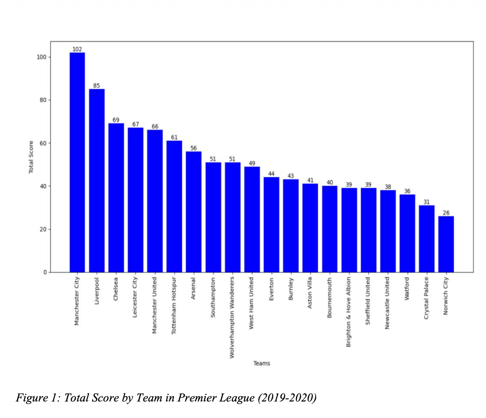
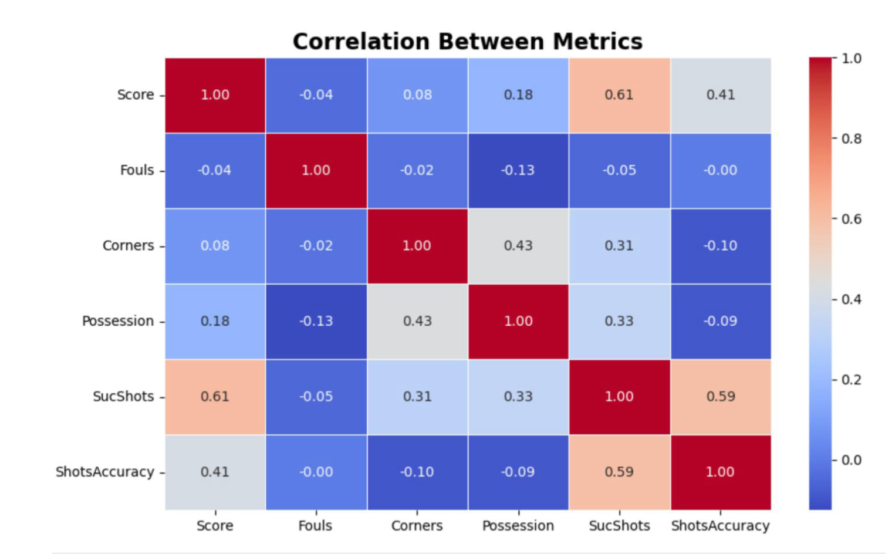
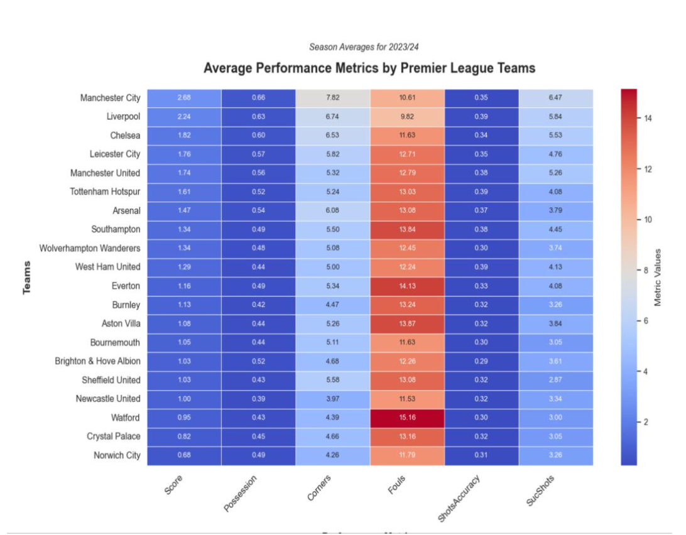
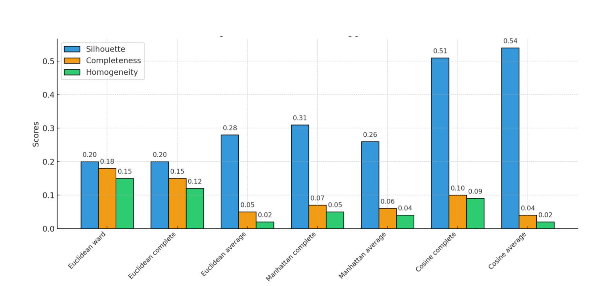
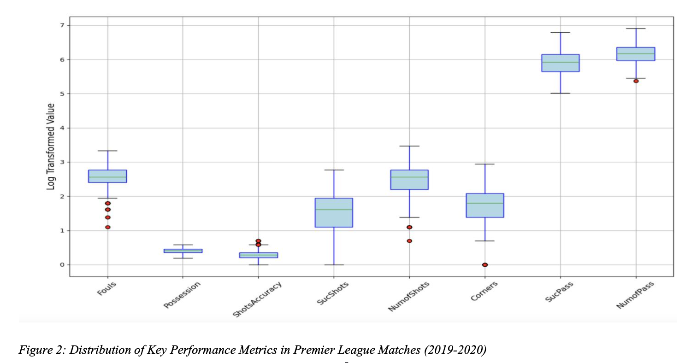

# ⚽ Premier League Football Performance Analysis

An end-to-end data analytics project exploring team performance in the Premier League (2019/20 season) using match statistics, data visualisation, and machine learning.

---

## 📊 Project Overview

This project analyses football match data to identify key performance factors that influence match outcomes. It combines exploratory data analysis, statistical relationships, and machine learning models to uncover patterns in team performance.

---

## 🔍 Key Insights

- Successful shots have the strongest relationship with match outcomes  
- Possession and passing contribute moderately to performance  
- Defensive metrics (fouls, saves) vary significantly across teams  
- Logistic regression achieved ~68% accuracy but struggled with class imbalance  

---

## 🛠 Tools & Technologies

- Python (Pandas, NumPy)
- Data Visualisation (Matplotlib, Seaborn)
- Scikit-learn (Clustering, Logistic Regression)
- Jupyter Notebook

---

## 📈 Visualisations

### Total Score by Team
Shows variation in team performance across the league.

### Correlation Between Metrics
Highlights relationships between match statistics and outcomes.

### Team Performance Heatmap
Compares teams across multiple performance metrics.

### Clustering Evaluation
Used to group teams based on similar performance characteristics.

### Distribution of Key Metrics
Shows spread and variability of match statistics.

---

## 🤖 Methods Used

- Data cleaning & preprocessing  
- Exploratory Data Analysis (EDA)  
- Correlation analysis  
- Clustering (K-Means, Hierarchical)  
- Logistic Regression  

---

## ⚠️ Limitations

- Model performance affected by class imbalance  
- Limited predictive accuracy (~68%)  
- Could be improved with more advanced models  

---

## 🚀 Future Improvements

- Apply SMOTE to balance classes  
- Use Random Forest / XGBoost  
- Hyperparameter tuning  
- Build an interactive dashboard (Streamlit)  

---

## 📁 Project Files

- `football-performance-analysis.ipynb` — main analysis  
- `premierLeague.xlsx` — dataset  
- `report.pdf` — full written report  
